# 金宇轮胎APS系统-成型排程完整技术文档

**文档版本**：V6.0.0  
**文档日期**：2026年3月23日  
**项目名称**：金宇轮胎生产排程系统（APS）-成型排程模块  
**版本说明**：Nick重新校验版本

---

## 文档变更记录

| 版本 | 日期 | 变更内容 | 变更人 |
|------|------|----------|--------|
| V6.0.0 | 2026-03-23 | 重新审查 | 许世超 |
| V5.0.0 | 2026-03-23 | 整合数据库设计V5.1.0（修正版）；新增约束规则配置表、试错分配日志表、班次均衡调整记录表等5张算法支持表 | 系统生成 |
| V4.1.0 | 2026-03-22 | 新增第十二部分"测试设计"；补充接口容错机制、性能分析、异常处理分支 | 系统生成 |
| V4.0.0 | 2026-03-21 | 整合蓝图文档业务需求、优化现状与优化项、完善接口设计 | 系统生成 |
| V3.0.0-B | 2026-03-21 | 整合B版本试错分配算法、波浪交替策略、顺位标识更新、班次均衡调整 | 系统生成 |
| V2.0.0 | 2026-03-21 | 整合架构设计优化方案和补充流程图 | 系统生成 |
| V1.0.0 | 2026-03-21 | 初始版本 | 系统生成 |

---


---


# 第四部分：数据库表设计


## 一、成型排产完整主流程

```mermaid
flowchart TD
    Start([开始]) --> Input[输入: 计划日期、计划天数]
    Input --> Phase1Start[S5.1 前置校验与初始化]
    
    subgraph Phase1Sub [阶段一: 前置校验与初始化]
        Phase1Start --> GetMesData[获取MES数据<br/>胎胚库存/在产规格]
        GetMesData --> GetCuringPlan[获取硫化工序日计划]
        GetCuringPlan --> GetMachines[获取可用成型机台]
        GetMachines --> CheckData[数据完整性校验]
        CheckData --> DataValid{数据有效?}
        DataValid -->|否| ErrorEnd([结束: 数据异常])
        DataValid -->|是| InitContext[初始化排程上下文]
        InitContext --> CalcRemainder
    end
    
    CalcRemainder[S5.2 计算成型余量]
    CalcRemainder --> LoopCuring[遍历硫化日计划]
    LoopCuring --> CalcCuringRem[计算硫化余量<br/>= 计划量 - 完成量]
    CalcCuringRem --> CalcMoldRem[计算成型余量<br/>= 硫化余量 - 胎胚库存]
    CalcMoldRem --> MarkEnding[标注收尾SKU<br/>3天内收尾或<400条]
    MarkEnding --> NextCuring{还有计划?}
    NextCuring -->|是| LoopCuring
    NextCuring -->|否| SortTasks
    
    SortTasks[S5.3 任务排序]
    SortTasks --> PriorityStart[应用优先级规则]
    
    subgraph PriorityRulesSub [优先级排序规则]
        PriorityStart --> Rule1[规则1: 续作优先]
        Rule1 --> Rule2[规则2: 收尾SKU优先]
        Rule2 --> Rule3[规则3: 硫化日计划顺序]
        Rule3 --> Rule4[规则4: 优先级字段排序]
    end
    
    PriorityStart --> GetPending[生成待排产任务列表]
    GetPending --> Phase3
    
    Phase3[S5.3 续作与新增任务排产]
    Phase3 --> DayLoop[遍历日期]
    DayLoop --> ShiftLoop[遍历班次<br/>早班/中班/夜班]
    
    ShiftLoop --> HandleStartStop[处理开停产计划]
    HandleStartStop --> IsStop{是否停产?}
    IsStop -->|是| SkipShift[跳过该班次]
    IsStop -->|否| HandleAccuracy
    
    HandleAccuracy[处理精度计划]
    HandleAccuracy --> FilterMachines[过滤可用机台]
    FilterMachines --> GetAvailableMachines[获取该班次可用机台]
    GetAvailableMachines --> Continue
    
    Continue[S5.3.1 续作排产]
    Continue --> LoopContinueMachines[遍历机台]
    LoopContinueMachines --> HasInProduction{机台有在产?}
    HasInProduction -->|否| CheckContinueNext
    HasInProduction -->|是| GetInProSpec[获取在产规格]
    GetInProSpec --> HasRemainder{余量>0?}
    HasRemainder -->|否| CheckContinueNext
    HasRemainder -->|是| CalcContinueQty[计算续作计划量]
    CalcContinueQty --> BuildContinueLine[构建续作排程行]
    BuildContinueLine --> MarkContinue[标记: 续作=true]
    MarkContinue --> UpdateContinueRem[更新余量]
    UpdateContinueRem --> CheckContinueNext{还有机台?}
    CheckContinueNext -->|是| LoopContinueMachines
    CheckContinueNext -->|否| NewSpec
    
    SkipShift --> ShiftNext
    NewSpec[S5.3.2 新增规格排产]
    NewSpec --> S5_3_10[新增规格处理]
    
    ShiftLoop --> AddToAllLines[添加到总排程列表]
    AddToAllLines --> ShiftNext{还有班次?}
    ShiftNext -->|是| ShiftLoop
    ShiftNext -->|否| DayNext
    DayLoop --> DayNext{还有日期?}
    DayNext -->|是| DayLoop
    DayNext -->|否| Phase4
    
    Phase4[S5.4 各个班次量均衡调整]
    Phase4 --> BalanceStart[收集班次数据]
    
    subgraph BalancePhaseSub [均衡调整]
        BalanceStart --> CollectData[收集班次数据]
        CollectData --> CompareStandard[对比班产标准]
        CompareStandard --> CheckDeviation{偏差范围?}
        CheckDeviation -->|正常| MarkNormal[标记: 正常]
        CheckDeviation -->|超下限| IncreaseQty[增加产量<br/>+12条/车]
        CheckDeviation -->|超上限| DecreaseQty[减少产量<br/>-12条/车]
        
        IncreaseQty --> CheckInventory{库存充足?}
        CheckInventory -->|否| LogInventoryWarn[记录库存警告]
        CheckInventory -->|是| ExecuteIncrease
        DecreaseQty --> CheckMinQty{>=最低产量?}
        CheckMinQty -->|否| KeepMin[保持最低]
        CheckMinQty -->|是| ExecuteDecrease
        ExecuteIncrease[执行增加]
        ExecuteDecrease[执行减少]
        
        ExecuteIncrease --> ValidateBalance
        ExecuteDecrease --> ValidateBalance
        MarkNormal --> ValidateBalance
        LogInventoryWarn --> ValidateBalance
        
        ValidateBalance[验证均衡结果]
    end
    
    ValidateBalance --> Phase5
    
    Phase5[S5.5 顺位标识与发布]
    Phase5 --> SetSequence[设置顺位标识]
    
    subgraph SequenceRulesSub [顺位标识规则]
        SetSequence --> SeqRule1[规则1: 续作优先<br/>sequence = 1]
        SeqRule1 --> SeqRule2[规则2: 收尾SKU<br/>sequence = 2]
        SeqRule2 --> SeqRule3[规则3: 固定规格<br/>sequence = 3]
        SeqRule3 --> SeqRule4[规则4: 新增规格<br/>sequence = 4]
    end
    
    SetSequence --> ValidateFinal[最终验证]
    ValidateFinal --> CheckConstraints{约束检查}
    
    subgraph ConstraintCheckSub [约束检查]
        CheckConstraints --> CheckTypeCount[胎胚种类数 <= 4]
        CheckTypeCount --> CheckRatio[成型硫化配比 <= 1.15]
        CheckRatio --> CheckSwitch[结构切换 <= 2次/天]
        CheckSwitch --> CheckInventoryFinal[库存时长检查]
    end
    
    CheckConstraints --> ConstraintsOK{全部通过?}
    ConstraintsOK -->|否| AdjustPlan[调整计划] --> ValidateFinal
    ConstraintsOK -->|是| SaveResult
    
    SaveResult[保存排程结果]
    SaveResult --> BatchInsert[批量插入数据库]
    BatchInsert --> PushMES[推送到MES系统]
    PushMES --> GenerateReport[生成排程报表]
    GenerateReport --> SendNotification[发送通知]
    SendNotification --> End([结束])
```

---

## 二、S5.3.10 试错分配算法详细流程

```mermaid
flowchart TD
    Start([开始]) --> Input[输入: 待排产任务列表、可用机台列表]
    Input --> PrepStart[S5.3.10.1 准备工作]
    
    subgraph PrepWork [准备工作]
        PrepStart --> GroupTasks[按规格分组待排产任务]
        GroupTasks --> SortByPriority[按优先级排序任务组]
        SortByPriority --> InitMachines[初始化机台状态]
        InitMachines --> InitCurrentLoad[设置当前负载 = 在产余量]
        InitCurrentLoad --> InitSkuCount[设置当前种类数 = 0]
        InitSkuCount --> SetGlobalBest[初始化全局最优方案]
    end
    
    SetGlobalBest --> TaskProcStart[S5.3.10.7 从第一个种类开始递归分配]
    TaskProcStart --> TaskLoop[遍历任务组]
    
    subgraph TaskProc [处理单个任务组]
        TaskLoop --> GetTaskInfo[获取任务信息<br/>规格/余量/优先级]
        GetTaskInfo --> FindMachineStart[S5.3.10.7.6 找能接活的机子]
        
        FindMachineStart --> MachineIter[遍历可用机台]
        
        subgraph MachineFilter [机台筛选]
            MachineIter --> CheckAvail{机台可用?}
            CheckAvail -->|否| NextMach[下一台]
            CheckAvail -->|是| CheckFixedSpec{是否固定规格?}
            
            CheckFixedSpec -->|是| MatchSpec{规格匹配?}
            MatchSpec -->|是| AddCand[加入候选列表]
            MatchSpec -->|否| CheckSwitchCond
            
            CheckFixedSpec -->|否| CheckSwitchCond[检查切换条件]
            CheckSwitchCond --> CheckSwitchCnt{今日切换次数<2?}
            CheckSwitchCnt -->|否| NextMach
            CheckSwitchCnt -->|是| CheckInch{英寸切换?}
            
            CheckInch -->|是| CheckShift{班次=早班?}
            CheckShift -->|否| NextMach
            CheckShift -->|是| CheckCap{产能充足?}
            
            CheckInch -->|否| CheckCap
            CheckCap -->|否| NextMach
            CheckCap -->|是| CheckInv{库存充足?}
            CheckInv -->|否| NextMach
            CheckInv -->|是| AddCand
            
            AddCand --> SortCand[按负载排序候选机台]
        end
        
        SortCand --> AllocEntry[进入分配计算]
        AllocEntry --> CalcAllocQty[计算可分配数量]
        
        subgraph AllocCalc [分配数量计算]
            CalcAllocQty --> GetTaskRem[获取任务余量]
            GetTaskRem --> GetMachCap[获取机台剩余产能]
            GetMachCap --> CheckInvQty[检查胎胚库存]
            CheckInvQty --> CalcMinQty[计算最小分配单位]
            CalcMinQty --> CalcResult["AllocQty = min(余量, 产能, 库存, 整车)"]
        end
        
        CalcResult --> CheckAlloc{可分配数量>0?}
        CheckAlloc -->|否| CheckMachLeft
        CheckAlloc -->|是| TryAssignEntry[开始尝试分配]
        
        subgraph TryAssign [尝试分配]
            TryAssignEntry --> SaveState[保存当前状态]
            SaveState --> UpdateMachLoad[更新机台负载]
            UpdateMachLoad --> UpdateSkuCnt[更新机台种类数]
            UpdateSkuCnt --> UpdateTaskRem[更新任务余量]
            UpdateTaskRem --> RecordSwitch[记录结构切换]
            
            RecordSwitch --> CheckTaskComplete{任务完成?}
            CheckTaskComplete -->|是| TaskDone[任务完成]
            CheckTaskComplete -->|否| RecurseAlloc[递归分配下一组]
            
            RecurseAlloc --> CompareBest[与全局最优比较]
            
            subgraph BestComp [最优方案比较]
                CompareBest --> CalcLoadDiff[计算负载差]
                CalcLoadDiff --> CalcTypeDiff[计算种类差]
                CalcTypeDiff --> GetBestDiff[获取最优方案的差]
                GetBestDiff --> IsBetter{新方案更优?}
                
                IsBetter -->|是| UpdateBest[更新全局最优方案]
                IsBetter -->|否| KeepBest[保持原最优方案]
                
                UpdateBest --> RestoreState
                KeepBest --> RestoreState
            end
            
            RestoreState --> NextCand{还有候选机台?}
            NextCand -->|是| ContinueTry[继续尝试]
            NextCand -->|否| NoMoreCand[无候选机台]
        end
        
        ContinueTry --> AllocEntry
        
        NoMoreCand --> CheckMachLeft{还有机台?}
        NextMach --> CheckMachLeft
        CheckMachLeft -->|是| MachineIter
        CheckMachLeft -->|否| RecordNoSol[记录无解状态]
        
        RecordNoSol --> TaskDone
        TaskDone --> NextTask{还有任务?}
        NextTask -->|是| TaskLoop
        NextTask -->|否| ReturnBestSol[返回最优方案]
    end
    
    ReturnBestSol --> CheckSuccess{找到可行方案?}
    CheckSuccess -->|否| NoSolEnd([结束: 无可行方案])
    CheckSuccess -->|是| OutputRes
    
    subgraph Output [输出结果]
        OutputRes --> GenLines[生成排程明细行]
        GenLines --> SetProdMode[设置生产模式<br/>投产/收尾]
        SetProdMode --> SetSeq[设置顺位标识]
        SetSeq --> ReturnList[返回排程明细列表]
    end
    
    ReturnList --> End([结束])
```

---

## 三、顺位标识定时更新流程

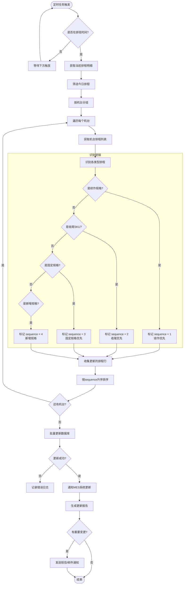

---

## 四、试错分配算法最优解判断逻辑

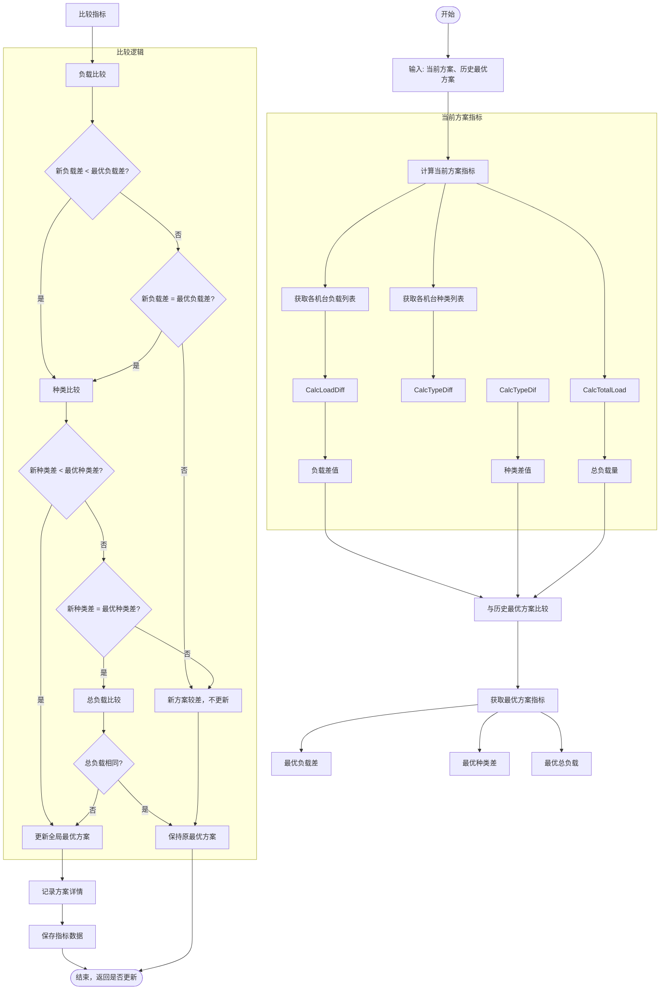

---

## 五、胎面整车波浪交替分配流程（补充）

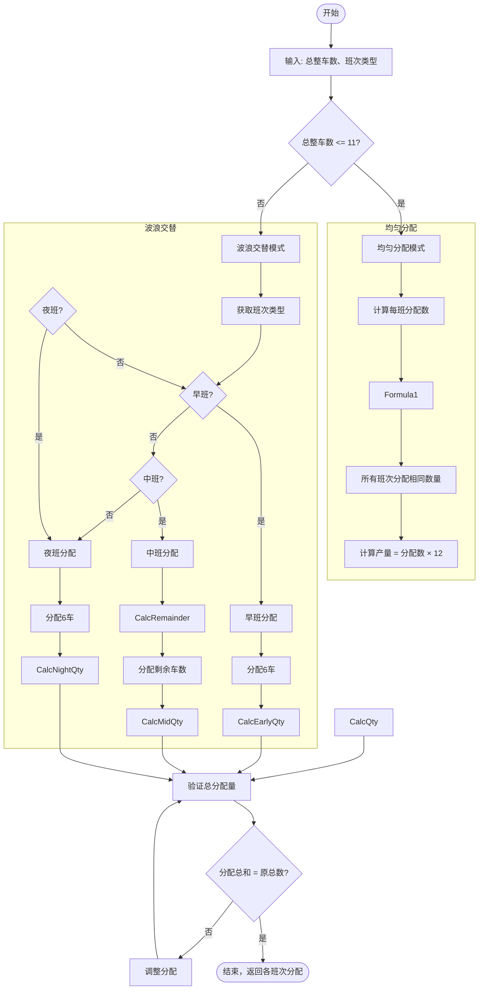

---

## 六、数据校验与初始化详细流程

```mermaid
flowchart TD
    Start([开始]) --> Trigger[触发: 一键生成成型计划]
    Trigger --> Phase1[S5.1 前置校验与初始化]
    
    Phase1 --> CollectData[收集基础数据]
    
    subgraph DataCollection [数据收集]
        CollectData --> Step1[Step 1: 获取胎胚实时库存]
        Step1 --> CallMES1[调用MES接口]
        CallMES1 --> GetInventory[获取胎胚库存数据]
        GetInventory --> ValidateInventory{库存数据有效?}
        ValidateInventory -->|否| ErrorInventory[记录错误: 库存数据异常]
        ValidateInventory -->|是| Step2
        
        Step2[Step 2: 获取成型机在产规格]
        Step2 --> CallMES2[调用MES接口]
        CallMES2 --> GetCurrentSpec[获取当前在产规格]
        GetCurrentSpec --> ValidateSpec{规格数据有效?}
        ValidateSpec -->|否| ErrorSpec[记录错误: 规格数据异常]
        ValidateSpec -->|是| Step3
        
        Step3[Step 3: 获取硫化工序日计划]
        Step3 --> CallMES3[调用MES接口]
        CallMES3 --> GetCuringPlan[获取硫化日计划]
        GetCuringPlan --> ValidateCuring{计划数据有效?}
        ValidateCuring -->|否| ErrorCuring[记录错误: 计划数据异常]
        ValidateCuring -->|是| Step4
        
        Step4[Step 4: 获取可用成型机台]
        Step4 --> QueryDB[查询数据库]
        QueryDB --> GetMachines[获取机台列表]
        GetMachines --> ValidateMachines{机台数据有效?}
        ValidateMachines -->|否| ErrorMachine[记录错误: 机台数据异常]
        ValidateMachines -->|是| Step5
        
        Step5[Step 5: 获取班产标准]
        Step5 --> QueryDB2[查询数据库]
        QueryDB2 --> GetStandards[获取班产标准]
        GetStandards --> ValidateStandards{标准数据有效?}
        ValidateStandards -->|否| ErrorStandard[记录错误: 标准数据异常]
        ValidateStandards -->|是| Step6
        
        Step6[Step 6: 获取配置参数]
        Step6 --> QueryConfig[查询配置中心]
        QueryConfig --> GetConfig[获取配置参数]
        GetConfig --> ValidateConfig{配置数据有效?}
        ValidateConfig -->|否| ErrorConfig[记录错误: 配置数据异常]
        ValidateConfig -->|是| Step7
        
        Step7[Step 7: 获取精度计划]
        Step7 --> QueryDB3[查询数据库]
        QueryDB3 --> GetAccuracy[获取精度计划]
        GetAccuracy --> ValidateAccuracy{精度数据有效?}
        ValidateAccuracy -->|否| ErrorAccuracy[记录错误: 精度数据异常]
        ValidateAccuracy -->|是| Step8
        
        Step8[Step 8: 获取开停产计划]
        Step8 --> QueryDB4[查询数据库]
        QueryDB4 --> GetStopStart[获取开停产计划]
        GetStopStart --> ValidateStopStart{计划数据有效?}
        ValidateStopStart -->|否| ErrorStopStart[记录错误: 开停产计划异常]
        ValidateStopStart -->|是| CheckErrors
    end
    
    CheckErrors{有错误记录?}
    CheckErrors -->|是| BuildErrorMessage[构建错误消息]
    BuildErrorMessage --> ThrowException[抛出数据异常]
    ThrowException --> EndError([结束: 初始化失败])
    CheckErrors -->|否| InitContext
    
    InitContext[初始化排程上下文]
    InitContext --> CreateContext[new MoldingScheduleContext]
    CreateContext --> SetStartDate[设置开始日期]
    SetStartDate --> SetDays[设置计划天数]
    SetDays --> SetMachines[设置机台列表]
    SetMachines --> SetInventories[设置库存数据]
    SetInventories --> SetCuringPlans[设置硫化计划]
    SetCuringPlans --> SetStandards[设置班产标准]
    SetStandards --> SetConfig[设置配置参数]
    SetConfig --> SetStopStart[设置开停产计划]
    SetStopStart --> ValidateContext
    
    ValidateContext[验证上下文完整性]
    ValidateContext --> CheckMachinesAvailable{有机台可用?}
    CheckMachinesAvailable -->|否| ErrorNoMachine[错误: 无可用机台]
    CheckMachinesAvailable -->|是| CheckPlansExist
    
    CheckPlansExist{有硫化计划?}
    CheckPlansExist -->|否| ErrorNoPlan[错误: 无硫化计划]
    CheckPlansExist -->|是| InitSuccess
    
    InitSuccess[初始化成功]
    InitSuccess --> CalcInventoryHours[计算库存时长]
    CalcInventoryHours --> SetContextReady[标记上下文就绪]
    SetContextReady --> ReturnContext
    
    ReturnContext[返回排程上下文]
    ReturnContext --> EndSuccess([结束: 初始化完成])
    
    ErrorInventory --> CheckErrors
    ErrorSpec --> CheckErrors
    ErrorCuring --> CheckErrors
    ErrorMachine --> CheckErrors
    ErrorStandard --> CheckErrors
    ErrorConfig --> CheckErrors
    ErrorAccuracy --> CheckErrors
    ErrorStopStart --> CheckErrors
    
    ErrorNoMachine --> EndError
    ErrorNoPlan --> EndError
```

---

## 七、班次量均衡调整详细流程

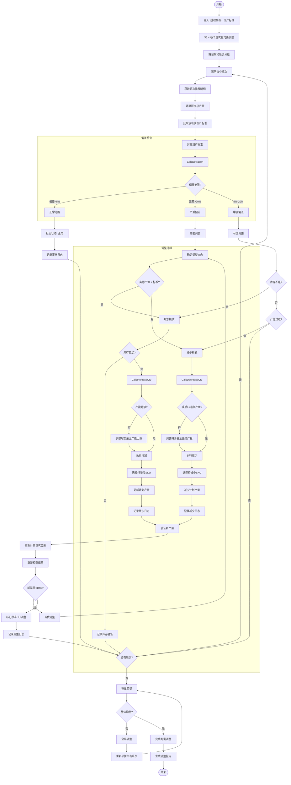

---

## 八、完整数据流向图（补充）

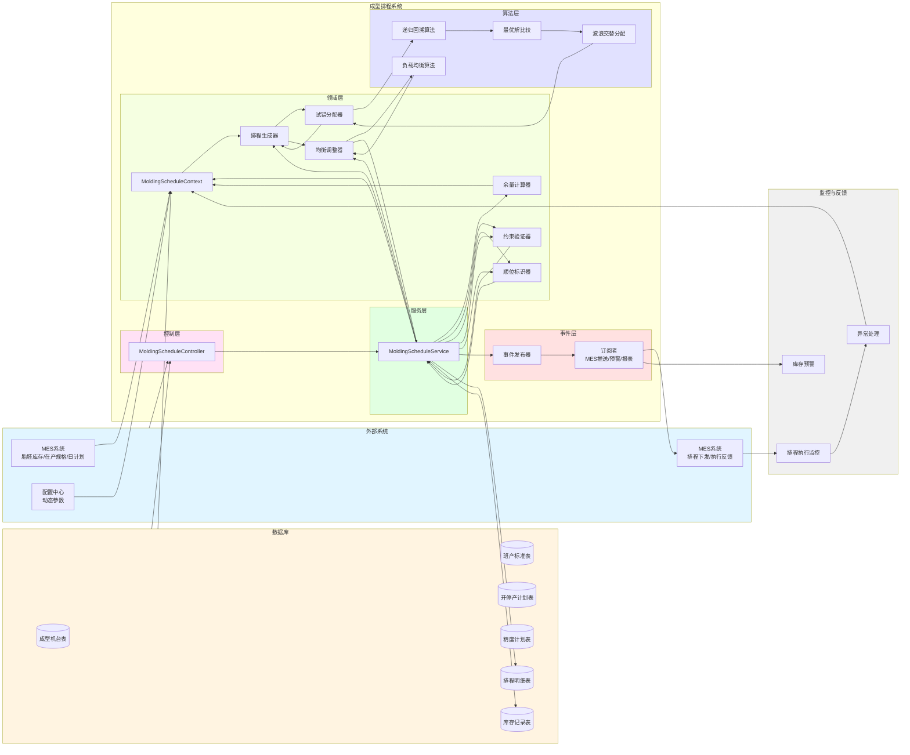

---

## 九、试错分配算法核心逻辑流程图

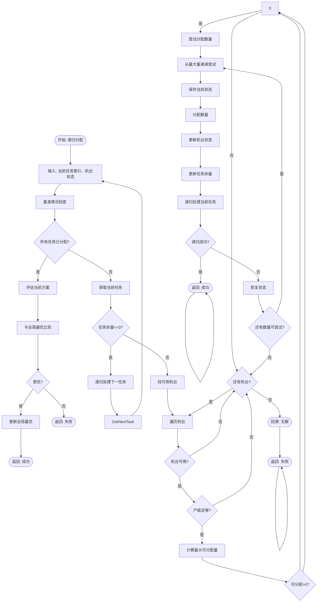

---

## 十、开产首班处理流程

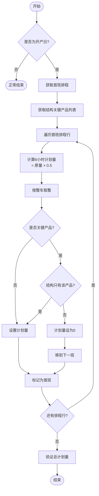

---

## 十一、停产最后一班处理流程

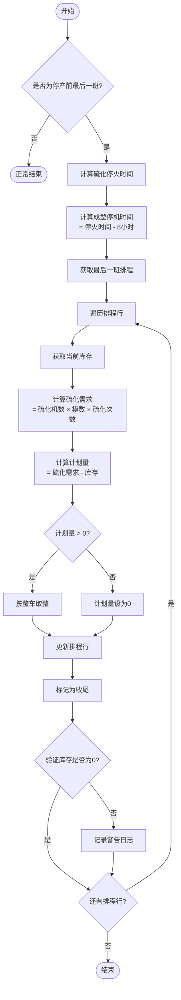

---

## 十二、产能不足处理流程

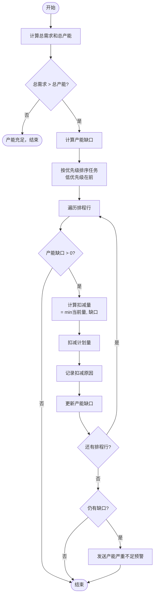

---

## 十三、库存爆满处理流程

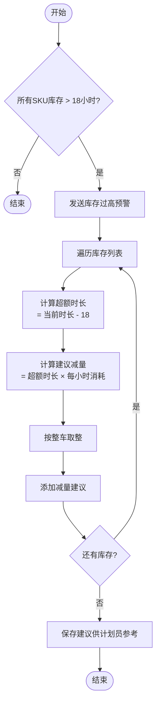

---

## 十四、试制校验流程

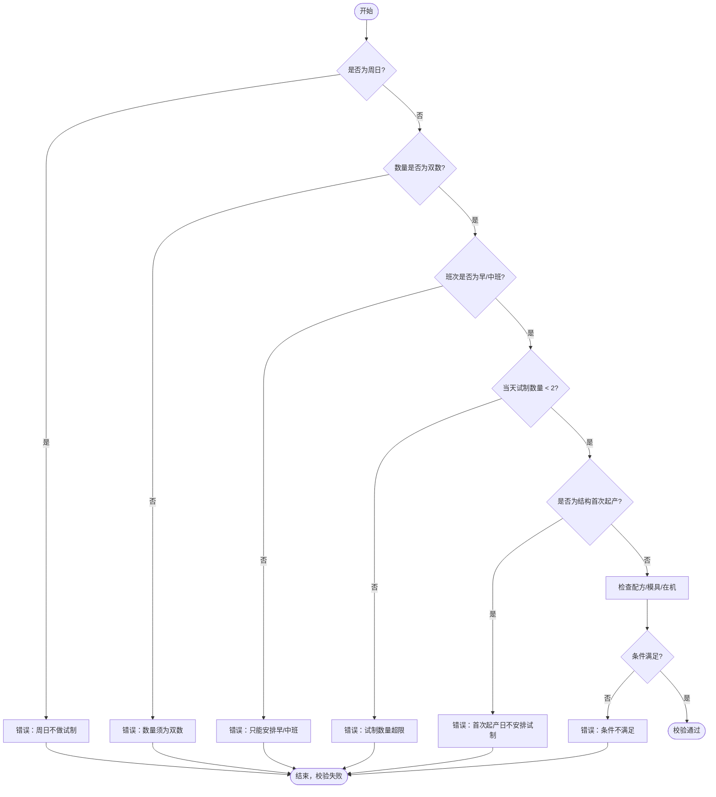

---

## 十五、胎面卷曲异常处理流程

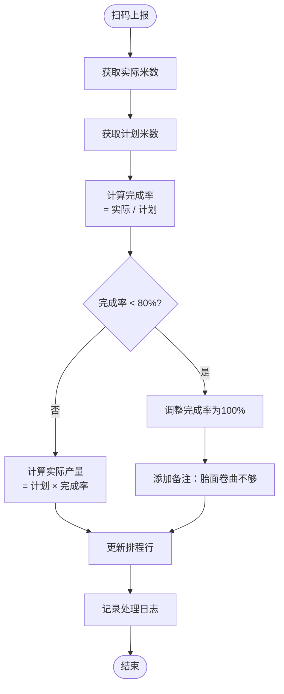

---

## 十六、大卷帘布用完处理流程

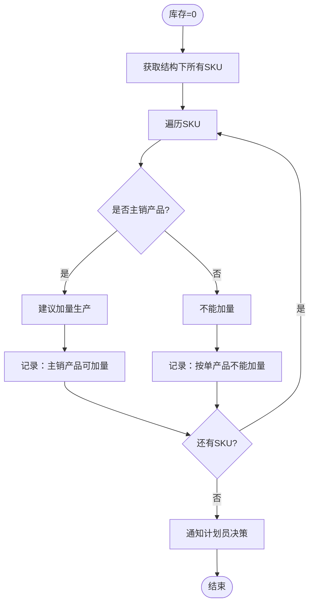

---

## 十七、精度计划冲突处理流程

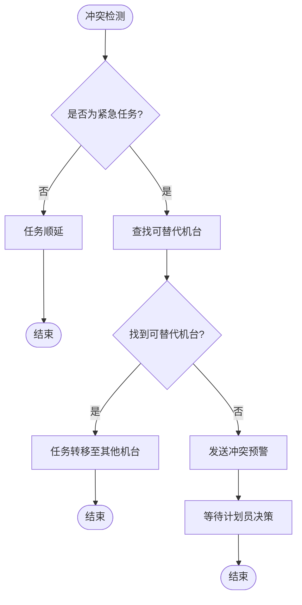

---

## 十八、事务恢复流程

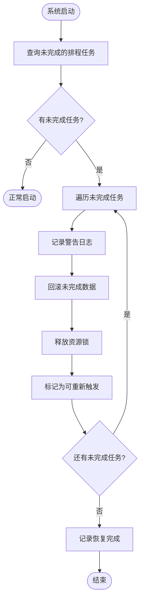

---

## 十九、动态调整并发控制流程

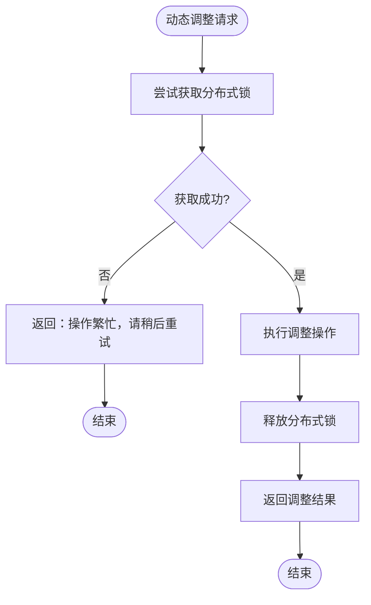

---

## 二十、其他流程图

### 10.1 胎胚库存时长计算流程

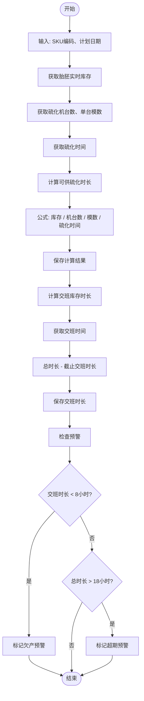

### 10.2 开停产处理流程

```mermaid
flowchart TD
    Start([开始]) --> Input[输入: 计划日期、班次]
    Input --> GetPlans[获取开停产计划]
    GetPlans --> CheckType{计划类型?}
    
    CheckType -->|开产| StartPlan
    CheckType -->|停产| StopPlan
    
    subgraph StartPlanFlow [开产处理]
        StartPlan[开产处理]
        StartPlan --> GetMachineCodes[获取开产机台列表]
        GetMachineCodes --> CheckFirstShift{是否首班开产?}
        CheckFirstShift -->|是| CalcFirstQty[计算首班产量 = 标准×0.5]
        CheckFirstShift -->|否| CalcNormalQty[使用标准产量]
        CalcFirstQty --> CreateScheduleLines
        CalcNormalQty --> CreateScheduleLines
        CreateScheduleLines[创建排程明细]
        CreateScheduleLines --> MarkStarting[标记投产=true]
        MarkStarting --> UpdateStatus[更新计划状态=执行中]
    end
    
    subgraph StopPlanFlow [停产处理]
        StopPlan[停产处理]
        StopPlan --> GetStopMachines[获取停产机台列表]
        GetStopMachines --> CheckStopMode{停产方式?}
        
        CheckStopMode -->|全部收尾| AllEnding
        CheckStopMode -->|分阶段| PhaseEnding
        
        AllEnding[全部收尾]
        AllEnding --> CheckInventory{有在制品库存?}
        CheckInventory -->|是| CalcEndingQty[计算收尾产量 = 库存量]
        CheckInventory -->|否| SetZero[计划量=0]
        CalcEndingQty --> CreateStopLines
        SetZero --> CreateStopLines
        
        PhaseEnding[分阶段收尾]
        PhaseEnding --> CalcPhaseQty[计算分阶段产量]
        CalcPhaseQty --> CreateStopLines
        
        CreateStopLines[创建停产排程明细]
        CreateStopLines --> MarkEnding[标记收尾=true]
        MarkEnding --> RecordReason[记录停产原因]
    end
    
    UpdateStatus --> End
    RecordReason --> End
    End([结束])
```

---


## D. 试错分配算法特点

**核心思想**：通过递归回溯的方式，尝试所有可能的分配方案，找出满足所有约束条件且使负载和种类数最均衡的最优方案。

**优点**：
- 保证找到全局最优解（如果存在）
- 可以处理复杂的约束条件
- 均衡性好

**缺点**：
- 计算复杂度高（指数级）
- 对于大规模问题需要剪枝优化

**剪枝策略**：
1. 提前终止：当某个任务无法分配时，立即回溯
2. 有序尝试：按优先级顺序尝试分配，更快找到可行解
3. 记忆化：缓存中间结果，避免重复计算
4. 下界估计：当当前方案已不可能优于最优方案时，提前终止


## E. 术语表

| 术语 | 英文 | 说明 |
|------|------|------|
| APS | Advanced Planning and Scheduling | 高级计划与排程系统 |
| SKU | Stock Keeping Unit | 库存保有单位 |
| MES | Manufacturing Execution System | 制造执行系统 |
| WMS | Warehouse Management System | 仓库管理系统 |
| TBR | Truck and Bus Radial | 全钢子午线轮胎 |
| PCR | Passenger Car Radial | 半钢子午线轮胎 |
| 胎胚 | Tire Embryo | 成型后的未硫化轮胎 |
| 硫化 | Curing | 轮胎生产的最后工序 |
| 成型 | Molding | 将各部件组合成胎胚的工序 |
| 结构 | Structure | 轮胎规格，如12R22.5 |
| 续作 | Continuation | 延续上一班次的生产 |
| 收尾 | Ending | 某SKU最后一批生产 |
| 投产 | Starting | 新SKU开始生产 |

## F. 文档变更记录

| 版本 | 日期 | 变更内容 | 变更人 |
|------|------|----------|--------|
| V4.1.0 | 2026-03-22 | 新增第十二部分"测试设计"；补充接口容错机制、性能分析、异常处理分支 | 系统生成 |
| V4.0.0 | 2026-03-21 | 整合蓝图文档业务需求、优化现状与优化项、完善接口设计 | 系统生成 |
| V3.0.0-B | 2026-03-21 | 整合B版本试错分配算法、波浪交替策略、顺位标识更新、班次均衡调整 | 系统生成 |
| V2.0.0 | 2026-03-21 | 整合架构设计优化方案和补充流程图 | 系统生成 |
| V1.0.0 | 2026-03-21 | 初始版本 | 系统生成 |

## G. 试制与量试规则

| 规则项 | 规则内容 |
|--------|----------|
| 提前申请 | 提前7天提交试制需求 |
| 条件检查 | 配方（制造示方、文字示方、硫化示方）、结构在机、模具 |
| 每日数量 | 一天最多做2个新胎胚 |
| 周日安排 | 周日不做试制 |
| 班次限制 | 只能安排在早班或中班（7:30-15:00） |
| 数量要求 | 必须是双数 |
| 紧急插单 | 紧急试制可在锁定期内插单，普通试制排到锁定期后1天 |
| 同一机台 | 试制和量试要在同一台成型机做 |
| 优先级 | 新胎胚优先级高于普通新增胎胚，但不能挤掉已排好的实单 |

## H. 精度计划规则

| 规则项 | 规则内容 |
|--------|----------|
| 校验周期 | 每个机台每两个月做一次 |
| 校验时长 | 每次4小时 |
| 每日数量 | 一天最多做2台 |
| 提前安排 | 正常提前3天安排（X号到期，安排在X-2号） |
| 班次安排 | 胎胚库存够吃超过一个班，安排在早班（7:30-11:30）；特殊情况可安排中班（13:00-17:00） |
| 硫化处理 | 精度期间成型机停机，胎胚库存够4小时以上硫化机继续生产，不够则减产一半 |

## I. 停产与开产规则

### 停产规则

| 时间节点 | 减量比例 |
|----------|----------|
| 倒数第3天 | 90% |
| 倒数第2天 | 80% |
| 倒数第1天 | 70% |

- 减量优先级：先减本来就没活的机台 → 当天刚好收尾的机台 → 客人少的结构 → 大订单
- 成型机停机时间：比硫化机停火提前1个班次
- 最后一班计划量：保证做完后胎胚库存刚好为0，正好够硫化机吃到停火

### 开产规则

| 规则项 | 规则内容 |
|--------|----------|
| 开机时间 | 成型机比硫化机提前1个班次开机 |
| 首班时长 | 只排6小时（不是正常8小时） |
| 首班产量 | 计划量减半 |
| 关键产品 | 开产第一个班不排关键产品，从第二个班才开始做（除非结构只有该产品） |

## J. 材料异常处理规则

### 胎面卷曲米数不够

- 操作工扫码上报实际米数
- 完成率低于80%（可配置）时，把完成率调成100%
- 在原因里备注"胎面卷曲不够"

### 大卷帘布用完

- 主销产品（月均销量≥500条）：可以加量生产（哪怕不在计划里），尽可能利用剩下的材料
- 按单生产的产品：不能加量

## K. 收尾管理规则

| 场景 | 处理方式 |
|------|----------|
| 10天内能做完 | 正常安排 |
| 10天内做不完 | 计算延误量，平摊到未来3天补回来 |
| 3天内补不完 | 通知月计划调整（调用接口） |
| 3天内要收尾 | 打上"紧急收尾"标签，优先安排 |
| 主销产品收尾 | 月均销量≥500条，收尾余量不够一整车时，按整车下 |
| 非主销产品收尾 | 收尾余量≤2条时舍弃，>2条时按实际量下 |

---

# 第十一部分：成型排程系统整体说明

## 一、系统是什么？

成型排程系统就是帮助计划员安排每天生产任务的工具。它负责把硫化车间要生产的胎胚需求，转化成每台成型机每个班次具体做什么、做多少、按什么顺序做。

系统要考虑很多因素：

- 成型机有多少台、哪些能用、哪些在保养
- 胎胚库里还有多少库存
- 今天硫化要消耗多少
- 每台成型机最多能做几种不同的胎胚（不能超过4种）
- 胎面是按"整车"来的，一车就是12条
- 胎面做好后要停放4小时才能用
- 节假日要提前减产、节后要恢复
- 研发要试制新胎胚
- 成型机要定期做精度校验
- 操作工请假要调整计划
- 有些结构（菜系）快要收尾了，要优先安排

系统要把这些复杂的情况都处理好，最后输出一张清晰的排产表，发给车间执行。

---

## 二、系统要处理的特殊场景

### 2.1 开产与停产

#### 停产（比如放长假）

- 停产前三天，每天的计划量要按比例减少：倒数第3天90%、倒数第2天80%、倒数第1天70%
- 减量的优先级：先减本来就没活的机台，再减当天刚好收尾的机台，然后减那些客人少的结构，最后才减大订单
- 成型机停机时间：比硫化机停火提前1个班次
- 最后一班的计划量要算好，保证做完后胎胚库存刚好为0，正好够硫化机吃到停火
- 如果某个结构在停产期间有换模能力，可以临时新增胎胚，这种不受"增模要在机3天"的限制

#### 开产（节假日结束）

- 成型机比硫化机提前1个班次开机
- 开产后第一个班只排6小时（不是正常8小时），计划量减半
- 如果这个结构里有"关键产品"（质量要求特别高的），开产第一个班不排这些产品，从第二个班才开始做。但如果这个结构只有这一个关键产品，那第一个班也只能排它

---

### 2.2 试制与量试（研发新胎胚）

研发部要试做新胎胚，提前7天把需求提交给系统。系统会检查三个条件：

- 配方有没有（制造示方、文字示方、硫化示方）
- 这个结构目前有没有成型机在生产（结构在机）
- 模具有没有

满足条件后，系统按以下规则排产：

- 一天最多做2个新胎胚，周日不做
- 如果某天是这个结构第一次起产，不安排新胎胚
- 紧急的可以在锁定期内插单，普通的排到锁定期后1天
- 同一个胎胚的试制和量试要在同一台成型机做（系统会记住试制用的机台，量试时优先选它）
- 新胎胚的优先级高于普通的新增胎胚，但不能挤掉已经排好的实单
- 只能安排在早班或中班（7:30-15:00），数量必须是双数

---

### 2.3 成型精度计划（设备校准）

品质部每周会下发精度计划，告诉系统哪些机台什么时候要做精度校验。每个机台每两个月做一次，每次4小时。

- 正常提前3天安排（比如X号到期，就安排在X-2号）
- 一天最多做2台
- 如果胎胚库存够吃超过一个班，就安排在早班（7:30-11:30）；特殊情况可以安排中班（13:00-17:00）

精度期间，成型机停机。系统会判断：如果胎胚库存够硫化机吃4小时以上，硫化机继续生产；如果不够，硫化机要减产一半，慢慢消化库存，等成型精度做完再恢复。

---

### 2.4 操作工请假

计划员可以在系统里登记哪个机台、哪个班次、哪个厨师请假。登记后，计划员人工把那个机台的计划往后顺延或转给其他机台。系统不自动处理，只记录和提醒。

---

### 2.5 收尾管理（月度计划层面的收尾）

系统会每天检查每个结构（菜系）的收尾情况。

1. 先算还要做多少才能收尾：硫化余量 - 胎胚库存
2. 看10天内能不能做完：
   - 如果做不完，就计算延误了多少，把这个延误量平摊到未来3天里，让这3天多做一点补回来
   - 如果未来3天把所有机台开足马力也补不完，系统就通知月计划调整（调用接口）
3. 如果3天内就要收尾，就打上"紧急收尾"标签，优先安排
4. 10天以外的，正常安排

这个检查每天都会做，因为库存和计划都在变。

---

## 三、日常排程怎么做（每天早上的流程）

### 第一步：看全局

计划员一上班，系统先帮他算好今天要做什么。

#### 算需求量

系统用公式计算每个胎胚今天要做多少条：

日胎胚计划量 = (硫化今天要吃掉的量 - 从库存里分给这个胎胚的量) × (1 + 损耗率)

其中，库存是按比例分给不同胎胚的（如果多个胎胚共用同一种胎胚的话）。

#### 检查收尾

系统把胎胚按结构分组，对每个结构算一下"还要做多少才能收尾"。按前面说的逻辑，给每个结构打上标签（紧急收尾、计划收尾、正常）。

#### 查看机台

系统列出所有成型机，哪些能用、哪些在保养、哪个昨天做了什么（历史任务）。如果有精度计划，今天要做精度的机台就扣掉4小时产能。如果有人请假，那个机台那个班次就标记为不可用。

#### 如果有节假日

- 停产：系统按比例减量，按优先级扣减
- 开产：系统提前1个班次开机，首班只排6小时，计划量减半

#### 如果有试制

系统把符合条件的试制胎胚加入待排菜单

#### 如果有关键产品

如果今天是开产日，系统会把关键产品的第一个班计划量设为0（除非这个结构只有它）

---

### 第二步：分配任务到机台

系统用"试错法"把胎胚分给各台成型机。

1. 先把胎胚按需求量从大到小排队，但紧急收尾的插到最前面
2. 对每个胎胚，系统尝试分给不同机台：
   - 如果昨天这个机台做过这个胎胚（老熟人），而且"强制保留"开关打开，这个机台可以优先接，而且不算新种类
   - 如果是新胎胚，只能找还没达到种类上限（最多4种）的机台
   - 在能接的机台里，优先选当前干活最少的、种类最少的
3. 尝试不同的分法：比如胎胚A需要80条，给机台1最多能接50条，就先试50条，不行再减到40条……直到所有胎胚分完，或者退回重试
4. 系统会记住所有可行的分法，最后选出"干活最平均"且"种类数最平均"的那个方案

---

### 第三步：把一天的任务拆成三个班

每个机台一天的总任务量定了，现在要分到早、中、夜三个班。

#### 基础规则

- 夜班:早班:中班 = 1:2:1（波浪形）
- 但生产要按"整车"来，一车是12条。所以先按比例算理论班产量（比如9-18-9），然后向上取整到12的倍数（12-24-12），再微调让总和等于日计划
- 如果某个班微调后变成0，允许，但尽量让三个班都有活

#### 特殊处理

- **开产首班**：只排6小时，计划量减半
- **停产最后一班**：精确计算，保证做完后库存为0，且正好够硫化吃到停火
- **关键产品**：开产日第一个班不排
- **收尾处理**：
  - 主销产品（月均销量≥500条）：收尾余量不够一整车时，按整车下
  - 非主销产品：收尾余量≤2条时舍弃，>2条时按实际量下
- **精度计划**：有精度的机台，要避开那4小时

---

### 第四步：排生产顺序

每个机台每个班要做哪些胎胚、各做多少整车都定了。现在要排谁先做、谁后做。

**核心原则**：谁最急（库存快没了）谁先做。紧急收尾的再优先。

#### 怎么算急不急？

预计库存可供硫化时长 = (胎胚实时库存 + 计划) / (硫化机数 × 单台模数)

这个时长越短，越急。

系统把每个"胎胚+整车"当成一个任务，先按"是否紧急收尾"分组，再按库存时长从小到大排顺序。

**预警**：如果某个胎胚的库存时长 > 18小时，说明库存太高了，系统会预警。

---

### 第五步：执行过程中动态调整

计划排好了，车间开始生产。但实际生产可能有快有慢，库存会有波动。系统每班结束前1小时会检查一次。

1. 算预计交班库存 = 当前库存 + 本班已做 + 本班剩余计划 – 本班剩余消耗
2. 算交班可供时长 = 预计交班库存 / (硫化机数×单台模数) – 剩余班次时间
3. 如果交班可供时长 < 6小时，说明到交班时库存只够吃6小时了，有断料风险。系统给下个班这个胎胚加1整车，同时从库存最长的胎胚下个班计划里减1整车，平衡总库存
4. 如果交班可供时长 > 18小时，系统预警

调整后还要重新算顺位，并且检查胎面能不能跟上：

- 胎面停放时间4小时，系统会算每个任务开始时胎面有没有到位
- 如果胎面还没到，顺位后移
- 如果胎面刚好卡着点（差10分钟以内），预警但不后移

这个调整会滚动影响未来8个班次，每班结束前都来一遍，保证计划一直"新鲜"。

---

### 第六步：处理材料异常

#### 胎面卷曲米数不够

如果胎面送到时，首卷或末卷长度不够，实际做不了那么多。操作工会扫码，系统拿到实际米数后，如果完成率低于80%（可配置），就把完成率调成100%，并在原因里备注"胎面卷曲不够"。这样就不会因为材料问题冤枉机台。

#### 大卷帘布用完

当大卷帘布（特殊材料）库存为0时，系统会触发计划修正。对于主销产品，可以加量生产（哪怕不在计划里），尽可能利用剩下的材料；对于按单生产的产品，不能加量。

---

### 第七步：发布计划

所有调整确认后，系统把未来8个班的详细计划发布到MES，车间各机台按单生产。系统会持续接收完成量回报，用于下一轮的动态调整。

---

## 四、输出什么

最终排程表包含：

- 哪个成型机台、供哪个硫化机台
- 做什么胎胚（物料编码、描述）
- 月计划多少、已经做了多少、还剩多少
- 当前胎胚库存
- 未来8个班（T日早/中、T+1日夜/早/中、T+2日夜/早/中）每个班的计划量、顺位、完成量、原因分析

**颜色标识**：

- 快收尾的（余量小于阈值）：橙色
- 新开规格：黄色
- 试制量试：蓝色

---

这样，整个成型排程系统就能在复杂的约束下，平稳高效地运转，既不让硫化机断料，也不让胎胚库存爆满，同时让每台成型机的工作量和种类数都尽量均衡。无论是日常、节假日、研发新胎胚、设备校准、材料异常、人员请假，还是月度收尾管理，都能从容应对。

---


**文档结束**
