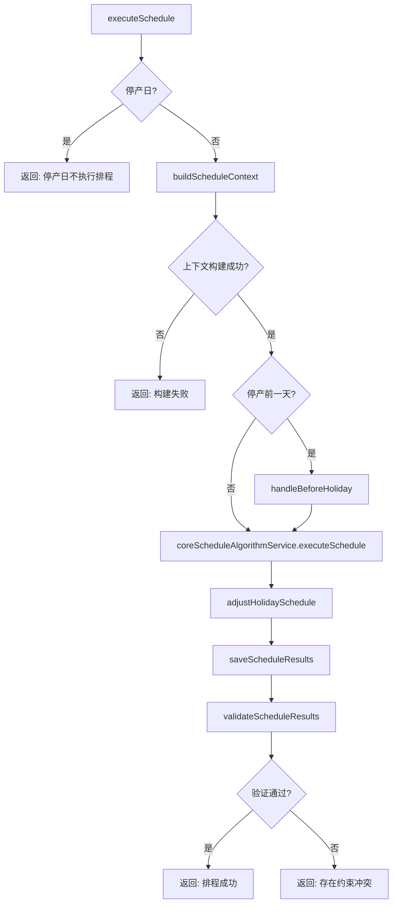
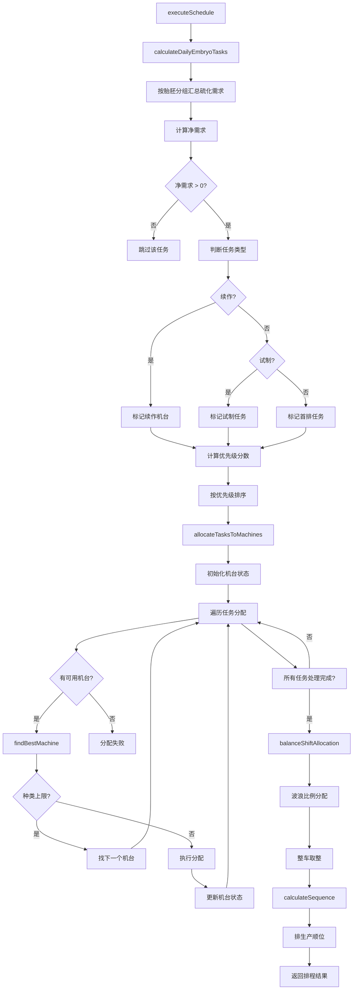

# ScheduleServiceImpl.executeSchedule 方法深度分析报告

**文档日期**：2026年3月23日  
**项目名称**：金宇轮胎APS系统-成型排程模块  
**分析方法**：`ScheduleServiceImpl.executeSchedule`  
**分析深度**：算法深度分析（5层调用链）

---

## 一、方法概览

### 1.1 方法签名
```java
public ScheduleResult executeSchedule(ScheduleRequest request)
```

### 1.2 位置信息
- **文件**：`/workspace/projects/src/main/java/com/zlt/aps/cx/service/impl/ScheduleServiceImpl.java`
- **行号**：110

### 1.3 方法职责
成型排程的主入口方法，协调所有排程子服务完成完整的排程流程。

### 1.4 核心调用链（5层）

```
executeSchedule (L1)
├── isStopProductionDay (L2) - holidayScheduleService
├── buildScheduleContext (L2) - 核心业务方法
│   ├── moldingMachineMapper.selectList (L3)
│   ├── materialInfoMapper.selectList (L3)
│   ├── stockMapper.selectList (L3)
│   ├── lhScheduleResultMapper.selectByDate (L3) - 主要任务来源
│   ├── onlineInfoMapper.selectByDateRange (L3) - 续作判断
│   ├── paramConfigMapper.selectList (L3)
│   ├── structureShiftCapacityMapper.selectList (L3)
│   ├── keyProductMapper.selectList (L3)
│   ├── monthSurplusMapper.selectByYearMonth (L3)
│   └── calculateStructureEndings (L3) - 收尾计算
├── handleBeforeHoliday (L2) - holidayScheduleService
├── coreScheduleAlgorithmService.executeSchedule (L2) - 核心算法
│   ├── calculateDailyEmbryoTasks (L3)
│   ├── allocateTasksToMachines (L3)
│   ├── balanceShiftAllocation (L3)
│   ├── calculateSequence (L3)
│   └── buildScheduleResults (L3)
├── adjustHolidaySchedule (L2) - holidayScheduleService
├── saveScheduleResults (L2)
└── validateScheduleResults (L2)
```

---

## 二、算法伪代码（带业务注释）

### 2.1 主流程 executeSchedule

```java
算法: executeSchedule

输入: request (ScheduleRequest) - 包含排程日期、排程模式
输出: result (ScheduleResult) - 包含排程结果列表

步骤 1: 节假日判断
    IF isStopProductionDay(request.scheduleDate) THEN
        // 停产日不执行排程
        result.message = "停产日，不执行排程"
        RETURN result
    END IF

步骤 2: 构建排程上下文
    context = buildScheduleContext(request)
    IF context == NULL THEN
        result.message = "构建排程上下文失败"
        RETURN result
    END IF
    
    # 构建上下文中加载的数据：
    context.availableMachines    = moldingMachineMapper.selectList(isActive=1)  // 可用机台
    context.materials            = materialInfoMapper.selectList()              // 物料信息
    context.stocks               = stockMapper.selectList(stockNum>0)           // 胎胚库存
    context.lhScheduleResults    = lhScheduleResultMapper.selectByDate()        // 硫化排程（主要任务）
    context.onlineInfos          = onlineInfoMapper.selectByDateRange()         // 在机信息（续作判断）
    context.machineOnlineEmbryoMap = buildMachineEmbryoMap(context.onlineInfos)  // 机台-胎胚映射
    context.structureEndings     = calculateStructureEndings()                  // 收尾计算
    context.monthSurplusMap      = monthSurplusMapper.selectByYearMonth()       // 月度计划余量
    context.mainProductCodes     = skuScheduleCategoryMapper.selectAllCategories()  // 主销产品

步骤 3: 节前特殊处理
    IF isBeforeHoliday(request.scheduleDate) THEN
        holidayResult = handleBeforeHoliday(context)
        # 节前处理：提前消化库存，避免节后积压
        LOG.info("停产前一天处理结果：{}", holidayResult.message)
    END IF

步骤 4: 执行核心排程算法
    results = coreScheduleAlgorithmService.executeSchedule(context)
    
    # 核心算法包含4个子步骤：
    # 子步骤 4.1: calculateDailyEmbryoTasks - 计算日胎胚任务
    # 子步骤 4.2: allocateTasksToMachines - 分配任务到机台
    # 子步骤 4.3: balanceShiftAllocation - 班次均衡分配
    # 子步骤 4.4: calculateSequence - 排生产顺位

步骤 5: 节假日调整
    results = adjustHolidaySchedule(request.scheduleDate, results, context)

步骤 6: 保存排程结果
    saveScheduleResults(results)
    # 保存到 T_CX_SCHEDULE_RESULT 和 T_CX_SCHEDULE_DETAIL

步骤 7: 验证排程结果
    validated = validateScheduleResults(results)
    IF validated THEN
        result.message = "排程成功"
    ELSE
        result.message = "排程完成，但存在约束冲突"
    END IF

RETURN result
```

### 2.2 子算法：calculateDailyEmbryoTasks

```java
算法: calculateDailyEmbryoTasks

输入: context (ScheduleContextDTO)
输出: tasks (List<DailyEmbryoTask>)

步骤 1: 构建数据映射
    materialMap = Map<materialCode, MdmMaterialInfo>   // 物料编码 -> 物料信息
    stockMap = Map<embryoCode, CxStock>               // 胎胚编码 -> 库存
    endingMap = Map<structureCode, CxStructureEnding>  // 结构编码 -> 收尾信息
    machineOnlineEmbryoMap = context.machineOnlineEmbryoMap  // 机台 -> 在产胎胚

步骤 2: 处理硫化排程任务（主要任务来源）
    FOR EACH embryoCode IN lhScheduleResults.groupby(embryoCode):
        
        # 2.1 计算硫化需求量（汇总该胎胚所有硫化机需求）
        totalVulcanizeDemand = SUM(lhResults.dailyPlanQty)
        
        # 2.2 获取当前库存
        currentStock = lhResults.embryoStock ?? stockMap.get(embryoCode).effectiveStock
        
        # 2.3 计算净需求
        netDemand = totalVulcanizeDemand - currentStock
        
        IF netDemand <= 0 THEN
            # 库存充足，无需生产
            CONTINUE
        END IF
        
        # 2.4 考虑损耗率（默认2%）
        dailyDemand = CEILING(netDemand * (1 + lossRate))
        
        # 2.5 获取整车容量（不同结构整车条数不同，如12、18）
        tripCapacity = getTripCapacity(structureCode, context)
        
        # 2.6 整车取整
        dailyDemand = ROUND_UP_TO_TRIP(dailyDemand, tripCapacity)
        
        # 2.7 判断续作（检查在机机台）
        continueMachineCodes = []
        FOR EACH machineCode IN machineOnlineEmbryoMap:
            IF machineOnlineEmbryoMap[machineCode].contains(embryoCode) THEN
                continueMachineCodes.add(machineCode)
            END IF
        END FOR
        isContinueTask = continueMachineCodes.isNotEmpty()
        
        # 2.8 判断试制任务
        isTrialTask = lhResults.ANY(isTrial == "1")
        
        # 2.9 判断首排任务
        isFirstTask = NOT isContinueTask AND NOT isTrialTask
        
        # 2.10 计算收尾余量
        vulcanizeSurplusQty = monthSurplusMap.get(embryoCode).planSurplusQty
        endingSurplusQty = vulcanizeSurplusQty - currentStock
        isEndingTask = endingSurplusQty <= 0
        
        # 2.11 判断主销产品
        isMainProduct = mainProductCodes.contains(embryoCode)
        
        # 2.12 计算机台数
        vulcanizeMachineCount = stockMap.get(embryoCode).vulcanizeMachineCount
        
        # 2.13 构建任务
        task = DailyEmbryoTask {
            materialCode: embryoCode,
            materialName: materialMap.get(embryoCode).materialDesc,
            structureCode: structureCode,
            demandQuantity: dailyDemand,
            isContinueTask: isContinueTask,
            isTrialTask: isTrialTask,
            isFirstTask: isFirstTask,
            isEndingTask: isEndingTask,
            isMainProduct: isMainProduct,
            continueMachineCodes: continueMachineCodes,
            priority: calculatePriorityScoreNew(task)
        }
        
        tasks.add(task)
    END FOR

步骤 3: 处理试制任务
    FOR EACH trialTask IN context.trialTasks:
        IF trialTask.status IN ["PENDING", "SCHEDULED"] THEN
            remainingQty = trialTask.trialQuantity - trialTask.producedQuantity
            task = createDailyEmbryoTask(remainingQty)
            task.isTrialTask = TRUE
            task.priority = 1500  // 试制任务高优先级
            tasks.add(task)
        END IF
    END FOR

步骤 4: 按优先级排序
    # 正确优先级顺序：续作 > 试制 > 首排
    # 收尾是任务属性，通过优先级分数体现
    tasks.sort(PRIORITY_COMPARATOR)
    
    # 排序规则：
    # 1. isContinueTask DESC (续作为TRUE排前面)
    # 2. isTrialTask DESC (试制排前面)
    # 3. isFirstTask DESC (首排排前面)
    # 4. priority DESC (分数高的排前面)

RETURN tasks
```

### 2.3 子算法：allocateTasksToMachines

```java
算法: allocateTasksToMachines

输入: tasks (List<DailyEmbryoTask>), context (ScheduleContextDTO)
输出: allocations (List<MachineAllocationResult>)

步骤 1: 初始化机台状态
    machineStatusMap = initMachineStatus(context)
    # 机台状态包含：
    # - dailyCapacity: 日产能（默认1200条）
    # - usedCapacity: 已使用产能
    # - remainingCapacity: 剩余产能
    # - assignedTypes: 已分配种类数
    # - currentStructure: 当前在产结构（用于续作判断）

步骤 2: 初始化机台物料映射
    machineMaterialMap = Map<machineCode, Set<materialCode>>

步骤 3: 分配任务
    FOR EACH task IN tasks:
        remainingQty = task.demandQuantity
        allocated = FALSE
        retryCount = 0
        
        WHILE remainingQty > 0 AND retryCount < 100:
            # 3.1 找最佳机台
            bestMachine = findBestMachine(task, machineStatusMap, machineMaterialMap, context)
            
            IF bestMachine == NULL THEN
                # 无可用机台，跳过该任务
                BREAK
            END IF
            
            # 3.2 获取机台状态
            machineResult = machineStatusMap.get(bestMachine.machineCode)
            
            # 3.3 计算可分配量
            assignQty = MIN(remainingQty, machineResult.remainingCapacity)
            
            # 3.4 检查种类上限（每机台≤4种）
            materials = machineMaterialMap.getOrCreate(bestMachine.machineCode)
            maxTypes = context.maxTypesPerMachine ?? 4
            IF materials.notContains(task.materialCode) AND materials.size >= maxTypes THEN
                # 种类已满，跳过此机台，继续找下一个
                retryCount++
                CONTINUE
            END IF
            
            # 3.5 执行分配
            IF assignQty > 0 THEN
                allocation = TaskAllocation {
                    materialCode: task.materialCode,
                    quantity: assignQty,
                    priority: task.priority,
                    isEndingTask: task.isEndingTask,
                    ...
                }
                machineResult.taskAllocations.add(allocation)
                machineResult.usedCapacity += assignQty
                machineResult.remainingCapacity -= assignQty
                materials.add(task.materialCode)
                machineResult.assignedTypes = materials.size
                remainingQty -= assignQty
                allocated = TRUE
            END IF
            
            retryCount++
        END WHILE
        
        # 更新任务分配结果
        task.assignedQuantity = task.demandQuantity - remainingQty
        task.remainingQuantity = remainingQty
    END FOR

步骤 4: 收集有分配的机台
    FOR EACH result IN machineStatusMap.values:
        IF result.taskAllocations.isNotEmpty() THEN
            allocations.add(result)
        END IF
    END FOR

RETURN allocations
```

### 2.4 子算法：findBestMachine（机台选择评分算法）

```java
算法: findBestMachine

输入: task, machineStatusMap, machineMaterialMap, context
输出: bestMachine (MdmMoldingMachine)

步骤 1: 遍历所有可用机台
    bestMachine = NULL
    bestScore = -1
    
    FOR EACH machine IN context.availableMachines:
        # 1.1 检查机台是否有剩余产能
        status = machineStatusMap.get(machine.machineCode)
        IF status == NULL OR status.remainingCapacity <= 0 THEN
            CONTINUE
        END IF
        
        # 1.2 检查结构约束
        IF NOT checkStructureConstraint(machine, task.material, context) THEN
            CONTINUE
        END IF
        
        # 1.3 检查种类上限
        currentTypes = machineMaterialMap.get(machine.machineCode)?.size ?? 0
        IF NOT checkTypeLimit(machine, currentTypes, task.material, context) THEN
            CONTINUE
        END IF
        
        # 1.4 计算机台得分
        score = calculateMachineScore(machine, task, status, context)
        
        # 1.5 更新最优机台
        IF score > bestScore THEN
            bestScore = score
            bestMachine = machine
        END IF
    END FOR

RETURN bestMachine

算法: calculateMachineScore

输入: machine, task, status, context
输出: score (int)

    score = 0
    
    # 【最高优先】续作机台 +1000分
    IF task.isContinueTask AND task.continueMachineCodes.contains(machine.machineCode) THEN
        score += 1000
    END IF
    
    # 昨日做过该胎胚 +500分
    IF context.yesterdayResults EXISTS machine.machineCode AND embryoCode == task.materialCode THEN
        score += 500
    END IF
    
    # 剩余产能越多越好 +remainingCapacity/10
    score += status.remainingCapacity / 10
    
    # 已分配种类越少越好 + (maxTypes - assignedTypes) * 50
    score += (maxTypes - status.assignedTypes) * 50
    
    # 固定生产该结构的机台 +200分
    IF machine.fixedStructure1.contains(task.structureName) THEN
        score += 200
    END IF
    
    # 固定生产该物料的机台 +300分
    IF machine.fixedMaterialCode.contains(task.materialCode) THEN
        score += 300
    END IF

RETURN score
```

### 2.5 子算法：balanceShiftAllocation

```java
算法: balanceShiftAllocation

输入: allocations (List<MachineAllocationResult>), context (ScheduleContextDTO)
输出: shiftAllocations (List<ShiftAllocationResult>)

步骤 1: 获取班次配置
    shiftCodes = context.shiftCodes ?? ["SHIFT_NIGHT", "SHIFT_DAY", "SHIFT_AFTERNOON"]
    # 默认班次顺序：夜班、早班、中班

步骤 2: 遍历每个机台
    FOR EACH allocation IN allocations:
        shiftResult = ShiftAllocationResult {
            machineCode: allocation.machineCode,
            tasks: allocation.taskAllocations
        }
        
        totalQty = allocation.usedCapacity
        shiftPlanQty = LinkedHashMap<shiftCode, qty>()
        
        # 2.1 获取结构班产配置
        structureCapacityMap = loadStructureShiftCapacity()
        
        # 2.2 计算波浪分配
        structureWaveAllocation = calculateStructureWaveAllocation(
            allocation.taskAllocations,
            structureCapacityMap,
            allocation.dailyCapacity,
            shiftCodes,
            context
        )
        
        # 2.3 汇总各班次分配量
        FOR EACH shiftCode IN shiftCodes:
            shiftPlanQty.put(shiftCode, structureWaveAllocation.get(shiftCode, 0))
        END FOR
        
        # 2.4 开产首班特殊处理
        IF context.isOpeningDay == TRUE THEN
            firstShift = context.formingStartShift ?? "SHIFT_DAY"
            
            # 首班不排关键产品
            keyProductQty = 0
            FOR EACH task IN allocation.taskAllocations:
                IF keyProductCodes.contains(task.materialCode) THEN
                    keyProductQty += task.quantity
                END IF
            END FOR
            
            IF keyProductQty > 0 THEN
                # 首班减去关键产品
                firstShiftQty = shiftPlanQty.get(firstShift)
                shiftPlanQty.put(firstShift, FLOOR(firstShiftQty - keyProductQty))
                
                # 移到下一班次
                secondShift = getNextShift(firstShift)
                secondShiftQty = shiftPlanQty.get(secondShift)
                shiftPlanQty.put(secondShift, secondShiftQty + CEILING(keyProductQty))
            END IF
        END IF
        
        shiftResult.shiftPlanQty = shiftPlanQty
        shiftAllocations.add(shiftResult)
    END FOR

RETURN shiftAllocations

算法: calculateStructureWaveAllocation

输入: tasks, structureCapacityMap, dailyCapacity, shiftCodes, context
输出: waveAllocation (Map<shiftCode, qty>)

    # 波浪比例：夜:早:中 = 1:2:1
    waveRatio = context.waveRatio ?? [1, 2, 1]
    adjustedRatio = adjustWaveRatio(waveRatio, shiftCodes)
    
    totalQty = SUM(tasks.quantity)
    tripCapacity = context.defaultTripCapacity ?? 12
    
    # 按比例分配
    FOR i = 0 TO shiftCodes.length - 1:
        shiftQty = totalQty * adjustedRatio[i] / SUM(adjustedRatio)
        # 整车取整
        shiftQty = ROUND_TO_TRIP(shiftQty, "ROUND", tripCapacity)
        waveAllocation.put(shiftCodes[i], shiftQty)
    END FOR

RETURN waveAllocation
```

---

## 三、业务规则列表

| 规则编号 | 条件 | 结果 | 说明 |
|---------|------|------|------|
| R-001 | `isStopProductionDay(scheduleDate)` = true | 不执行排程，直接返回 | 包括周末、法定节假日、公司停产日 |
| R-002 | `isBeforeHoliday(scheduleDate)` = true | 执行节前特殊处理 | 提前消化库存，避免节后积压 |
| R-003 | `netDemand <= 0` | 跳过该任务，不生产 | 库存充足，无需生产 |
| R-004 | 机台已在生产某胎胚 | 必须继续，不可中断 | 续作任务固定原机台，优先级最高 |
| R-005 | 每台机台同时生产规格数 >= 4 | 不能分配新规格 | 种类上限约束 |
| R-006 | 机台 isActive != 1 | 跳过该机台 | 机台未启用 |
| R-007 | 机台有精度计划 | 扣减该班次对应产能 | 精度期间不可用 |
| R-008 | 开产首班排关键产品 | 关键产品移到下一班次 | 开产首班不排关键产品 |
| R-009 | 任务是试制/量试 | 优先级高于首排任务 | 试制任务分数1500 |
| R-010 | 任务是收尾任务 | 通过优先级分数体现紧急程度 | 收尾是任务属性，非独立优先级 |
| R-011 | 库存时长 > 24小时 | 降低优先级 | 胎胚最长停放时间约束 |
| R-012 | 月度计划余量 <= 0 | 标记为收尾任务 | 硫化余量-库存<=0 |

---

## 四、计算公式列表

| 公式编号 | 变量 | 公式 | 说明 |
|---------|------|------|------|
| F-001 | `netDemand` | `netDemand = totalVulcanizeDemand - currentStock` | 净需求 = 硫化需求 - 库存 |
| F-002 | `dailyDemand` | `dailyDemand = CEILING(netDemand × (1 + lossRate))` | 考虑损耗后的日需求 |
| F-003 | `dailyDemand` | `dailyDemand = ROUND_UP_TO_TRIP(dailyDemand, tripCapacity)` | 整车取整（向上） |
| F-004 | `endingSurplusQty` | `endingSurplusQty = vulcanizeSurplusQty - currentStock` | 收尾余量 = 硫化余量 - 库存 |
| F-005 | `isEndingTask` | `isEndingTask = (endingSurplusQty <= 0)` | 收尾任务判断 |
| F-006 | `assignQty` | `assignQty = MIN(remainingQty, machineResult.remainingCapacity)` | 可分配量取小值 |
| F-007 | `priorityScore` | 见 `calculatePriorityScoreNew` 方法 | 综合优先级评分 |
| F-008 | `machineScore` | `machineScore = 1000 + 500 + remaining/10 + (maxTypes-assigned)*50 + ...` | 机台评分公式 |
| F-009 | `shiftQty` | `shiftQty = CEILING(totalQty × waveRatio[i] / totalRatio)` | 班次分配量 |
| F-010 | `precisionDeduction` | `precisionDeduction = precisionHours × hourlyCapacity` | 精度计划扣减产能 |

---

## 五、数据流转表

| 数据项 | 来源 | 处理 | 目标 |
|-------|------|------|------|
| 可用机台列表 | `moldingMachineMapper.selectList` | selectList(isActive=1) | context.availableMachines |
| 物料信息 | `materialInfoMapper.selectList` | selectList() | context.materials |
| 胎胚库存 | `stockMapper.selectList` | selectList(stockNum>0) | context.stocks |
| 硫化排程任务 | `lhScheduleResultMapper.selectByDate` | selectByDate() | context.lhScheduleResults |
| 在机信息 | `onlineInfoMapper.selectByDateRange` | selectByDateRange(today, yesterday) | context.onlineInfos |
| 机台在机胎胚映射 | `context.onlineInfos` | buildMap(cxCode → embryoCode) | context.machineOnlineEmbryoMap |
| 月度计划余量 | `monthSurplusMapper.selectByYearMonth` | selectByYearMonth(year, month) | context.monthSurplusMap |
| 结构收尾信息 | `monthPlanMapper.selectByYearMonth` | calculateStructureEndings() | context.structureEndings |
| 主销产品编码 | `skuScheduleCategoryMapper` | filter(scheduleType='01') | context.mainProductCodes |
| 日胎胚任务 | `context` | calculateDailyEmbryoTasks() | List<DailyEmbryoTask> |
| 机台分配结果 | `tasks` | allocateTasksToMachines() | List<MachineAllocationResult> |
| 班次分配结果 | `allocations` | balanceShiftAllocation() | List<ShiftAllocationResult> |
| 排程明细 | `shiftAllocations` | calculateSequence() | List<CxScheduleDetail> |
| 排程结果 | `details` | buildScheduleResults() | List<CxScheduleResult> |
| 排程结果保存 | `results` | insert() | T_CX_SCHEDULE_RESULT |
| 排程明细保存 | `details` | insert() | T_CX_SCHEDULE_DETAIL |

---

## 六、配置参数和阈值

| 参数名 | 类型 | 默认值 | 来源 | 说明 |
|-------|------|--------|------|------|
| maxTypesPerMachine | int | 4 | context.maxTypesPerMachine | 每台机台最大规格种类数 |
| waveRatio | int[] | {1, 2, 1} | context.waveRatio | 班次产量比例：夜:早:中 |
| lossRate | BigDecimal | 0.02 | context.lossRate | 损耗率（默认2%） |
| defaultTripCapacity | int | 12 | context.defaultTripCapacity | 默认整车容量（条/车） |
| shiftCodes | String[] | {夜,早,中} | context.shiftCodes | 班次编码数组 |
| reservedDigestHours | int | 1 | context.reservedDigestHours | 预留消化时间（小时） |
| maxParkingHours | int | 24 | context.maxParkingHours | 胎胚最长停放时间（小时） |
| trialTaskPriority | int | 1500 | 代码常量 | 试制任务优先级分数 |
| continueTaskBonus | int | 1000 | 代码常量 | 续作机台加分 |
| yesterdayTaskBonus | int | 500 | 代码常量 | 昨日做过加分 |
| fixedStructureBonus | int | 200 | 代码常量 | 固定结构加分 |
| fixedMaterialBonus | int | 300 | 代码常量 | 固定物料加分 |

---

## 七、关键算法说明

### 7.1 续作任务处理

续作任务是最高优先级的任务类型。处理逻辑：

1. **识别**：从 `T_MDM_CX_MACHINE_ONLINE_INFO` 获取当前在机信息，如果某机台正在生产某胎胚，则该胎胚今天必须继续在该机台生产
2. **分配**：续作任务**固定分配到原机台**，不可抢占
3. **优先级**：续作机台获得 +1000 分的评分加成

```java
IF task.isContinueTask AND task.continueMachineCodes.contains(machine.machineCode) THEN
    score += 1000  // 续作最高优先
END IF
```

### 7.2 试错分配算法

当需要分配新任务（非续作）时，采用试错分配算法：

1. 按优先级排序所有任务（续作 > 试制 > 首排）
2. 对每个任务，遍历所有可用机台找最优
3. 如果最优机台的种类已满（>=4种），跳过继续找下一个
4. 如果所有机台都无法接受，任务分配失败

**机台评分因素**：
- 续作机台 +1000
- 昨日做过 +500
- 剩余产能多 +remaining/10
- 种类少 +(maxTypes-assigned)*50
- 固定结构 +200
- 固定物料 +300

### 7.3 波浪交替分配

班次产能按波浪比例分配，默认为**夜:早:中 = 1:2:1**：

1. 计算总产量和总比例
2. 按比例分配到各班次
3. 整车取整
4. 处理余量

### 7.4 收尾任务判断

收尾任务是月度计划即将结束的结构：

```
收尾余量 = 硫化余量 - 胎胚库存
收尾任务 = (收尾余量 <= 0) OR (剩余天数 <= 3天 且 有剩余量)
```

---

## 八、流程图

### 8.1 主流程



### 8.2 核心算法流程



---

## 九、注意事项

### 9.1 关键数据依赖

1. **硫化排程结果（LhScheduleResult）**：是成型排程的主要任务来源，必须准确
2. **机台在线信息（OnlineInfo）**：用于判断续作任务，必须实时更新
3. **月度计划余量（MonthSurplus）**：用于判断收尾任务
4. **胎胚库存（Stock）**：用于计算净需求

### 9.2 性能考虑

1. 试错分配算法的最大重试次数限制为100次
2. 班次均衡使用整车取整，避免碎片化
3. 数据映射使用 HashMap 提高查询效率

### 9.3 异常处理

1. 排程上下文构建失败，直接返回失败
2. 所有数据库操作都在事务中执行
3. 验证失败不影响结果保存，只记录警告

---

**文档生成时间**：2026-03-23  
**分析方法**：java-method-scanner 深度分析  
**分析深度**：5层调用链 + 算法伪代码 + 业务规则提取
